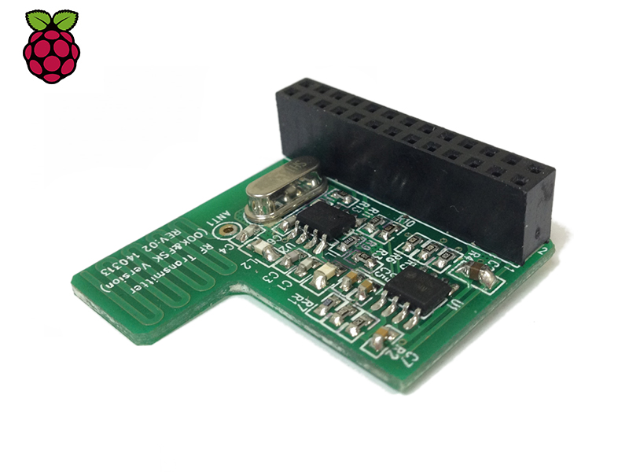

# Energenie Switches

Python scripts for configuring and managing the remote power switches from [Energenie](https://energenie4u.co.uk)



It's worth noting that there are two versions of these that I'm familiar with:

- The older [`ENER002`](https://energenie4u.co.uk/catalogue/product/ENER002-2PI) boards
- Newer `ENER314` "two-way" boards - these have a coil on them.

Code in this repo is split into `v1` for the older boards and `v2` for the newer.

## ENER002

The old boards are "one-way". This means that while you can control them from the RPi, the boards will not update when you switch the plug via the button on remote switch. In contrast, the newer boards are "two-way". So you can turn them on/off via the RPi, but the remote switch will also inform the RPi when you manually toggle the button. This is important when using Apple Home etc. where you want to be able to get the status of the switch (not possible with this older version)

### Pairing

To put a plug into pairing mode, hold the button down until it slow-flashes. Then reset using the `v1` code:

```py
python switch.py on 1
```

Where 1 is the number to assign to that plug (between 1 and 4)

### On/Off

You can then control it via:

```py
python switch.py on 1
python switch.py off 1
```

### Resetting

If you continue to hold down the button on the switch it will go from a slow flash to a long flash. This means it's reset (as far as I know)

## Resources

- https://github.com/MiniGirlGeek/energenie-demo/blob/master/energenie.py
